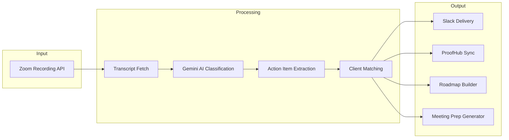

# Zoom Action Items — AI Meeting Intelligence Pipeline


Transform Zoom meeting recordings into actionable intelligence — automatically extract action items, sync to project management tools, generate strategic roadmaps, and prepare for upcoming meetings.

---

## The Problem

Teams have 30+ meetings per week. Action items get lost in transcripts. Manual note-taking is incomplete and delayed. Follow-ups fall through the cracks.

---

## The Solution

An end-to-end pipeline that automatically processes Zoom recordings and delivers actionable intelligence across multiple channels.



---

## Key Features

- **Automatic Zoom transcript polling** — Configurable lookback window, processes new recordings every 15 minutes
- **AI-powered action item extraction** — Gemini 2.0 Flash identifies tasks, owners, deadlines, and decisions
- **Smart client matching** — Fuzzy name matching + attendee email mapping to route meetings to the right client
- **Strategic roadmap generation** — Gemini 2.5 Flash creates executive summaries and tracks commitments over time
- **Meeting prep automation** — Context from last N meetings, open items, stale tasks, suggested talking points
- **ProofHub task synchronization** — Auto-push action items to project management with confidence scoring
- **Real-time Slack notifications** — Per-client channels with formatted action items and decisions
- **Web dashboard** — Google OAuth protected interface for reviewing meetings, editing items, managing roadmaps

---

## Tech Stack

| Category | Technologies |
|----------|-------------|
| **Runtime** | Node.js, Express, PM2 |
| **Database** | SQLite (WAL mode) |
| **AI/ML** | Google Gemini API (2.0 Flash, 2.5 Flash) |
| **Integrations** | Zoom S2S OAuth, Slack API, ProofHub API, Google OAuth |
| **Frontend** | Vanilla JS, Server-rendered HTML |

---

## How It Works

1. **Poll Zoom** — Pipeline queries Zoom Recording API for new recordings in the configured lookback window
2. **Fetch Transcripts** — VTT transcripts downloaded and parsed into speaker-attributed segments
3. **AI Classification** — Gemini analyzes transcript chunks, identifies meeting type, extracts structured data
4. **Extract Action Items** — Tasks, owners, deadlines, decisions, and key discussion points extracted
5. **Match Client** — Fuzzy matching on meeting title + attendee emails maps to client configuration
6. **Deliver to Slack** — Formatted message posted to client-specific or general channel
7. **Sync to ProofHub** — High-confidence items auto-pushed; drafts queued for human review
8. **Build Roadmap** — Cross-meeting analysis creates strategic roadmap with status tracking
9. **Generate Prep** — Before meetings, dashboard shows context, open items, suggested agenda

---

## Results

- Processes **30+ meetings/week** across multiple clients
- **Zero missed action items** since deployment
- Meeting prep saves **15-30 minutes** per meeting
- Roadmap generation replaces **2-3 hours** of manual summary work weekly
- Action item extraction accuracy: **>90%** for explicitly stated tasks

---

## Project Structure

```
zoom-action-items/
├── src/
│   ├── poll.js              # Main pipeline entry point
│   ├── api/                  # Express API server
│   ├── lib/
│   │   ├── zoom-client.js    # Zoom API integration
│   │   ├── ai-extractor.js   # Gemini AI processing
│   │   ├── client-matcher.js # Client identification
│   │   ├── slack-publisher.js# Slack notifications
│   │   ├── auto-push.js      # ProofHub sync
│   │   ├── roadmap-*.js      # Roadmap generation
│   │   └── prep-*.js         # Meeting prep generation
│   └── config/
│       └── clients.json      # Client configuration
├── public/                   # Dashboard frontend
├── scripts/                  # Utility scripts
└── data/                     # SQLite databases (gitignored)
```

---

## Configuration

Requires environment variables:

```bash
# Zoom S2S OAuth
ZOOM_ACCOUNT_ID=...
ZOOM_CLIENT_ID=...
ZOOM_CLIENT_SECRET=...

# Google Gemini
GOOGLE_API_KEY=...

# Slack
SLACK_BOT_TOKEN=...

# ProofHub (optional)
PROOFHUB_API_KEY=...
PROOFHUB_SUBDOMAIN=...

# Google OAuth (for dashboard)
GOOGLE_CLIENT_ID=...
GOOGLE_CLIENT_SECRET=...
SESSION_SECRET=...
```

---

## Running

```bash
# Install dependencies
npm install

# Run pipeline once
node src/poll.js

# Run with PM2 (production)
pm2 start ecosystem.config.js

# Start dashboard
node src/api/server.js
```

---

## License

MIT
