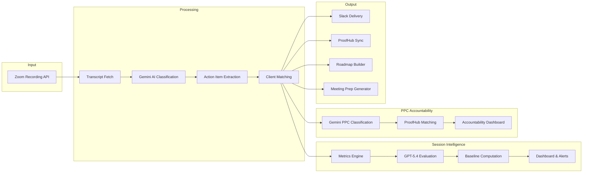

# Zoom Action Items — AI Meeting Intelligence Pipeline


Transform Zoom meeting recordings into actionable intelligence — automatically extract action items, sync to project management tools, generate strategic roadmaps, evaluate meeting quality with AI-powered Session Intelligence, and track PPC task accountability across meetings.

---

## The Problem

Teams have 30+ meetings per week. Action items get lost in transcripts. Manual note-taking is incomplete and delayed. Follow-ups fall through the cracks. Meeting quality is unmeasured and coaching is reactive. PPC-related tasks discussed in meetings are never verified as completed.

---

## The Solution

An end-to-end pipeline that automatically processes Zoom recordings and delivers actionable intelligence across multiple channels.



---

## Key Features

### Pipeline Features
- **Automatic Zoom transcript polling** — Configurable lookback window, processes new recordings every 15 minutes
- **AI-powered action item extraction** — Gemini 2.0 Flash identifies tasks, owners, deadlines, and decisions
- **Smart client matching** — Fuzzy name matching + attendee email mapping to route meetings to the right client
- **Strategic roadmap generation** — Gemini 2.5 Flash creates executive summaries and tracks commitments over time
- **Meeting prep automation** — Context from last N meetings, open items, stale tasks, suggested talking points
- **ProofHub task synchronization** — Auto-push action items to project management with confidence scoring
- **Real-time Slack notifications** — Per-client channels with formatted action items and decisions
- **Web dashboard** — Google OAuth protected interface for reviewing meetings, editing items, managing roadmaps

### Session Intelligence Features
- **Session Intelligence scoring** — GPT-5.4 evaluates every meeting on 12 quality dimensions across 3 weighted tiers (Deal Breakers 40%, Core Competence 35%, Efficiency 25%)
- **Multi-model evaluation** — Tested claude-opus-4-6, gpt-5.4, gemini-2.0-flash, gemini-3.1-pro-preview; GPT-5.4 selected as production default via consensus calibration
- **Meeting scorecards** — Per-meeting breakdown with composite score, dimension scores, coaching insights with transcript quotes, prev/next navigation, score deltas
- **Client health monitoring** — Agency-wide benchmarks (P25/P50/P75), client trend charts, team performance with difficulty-adjusted scores
- **Three-tier flagging system** — Client-grouped, trend-based flags with urgency scoring (replaces noisy threshold-based flagging)
- **No-show detection** — Automatic classification of no-shows, test recordings, and internal meetings; excluded from quality metrics with NULL composites
- **AI-powered UX testing** — Playwright + Gemini vision audit agent validates the dashboard across 50+ checks
- **Human calibration framework** — Score meetings manually to validate AI model accuracy (MAE + Pearson correlation)
- **Weekly coaching digest** — Slack-formatted digest with per-member coaching, pattern alerts, frustration spikes

### PPC Task Accountability
- **LLM-powered PPC classification** — Gemini 2.0 Flash classifies action items as PPC-related (Google Ads, LSA, Meta, Bing)
- **ProofHub verification** — GPT-5.4 semantic matching against ProofHub tasks to verify accountability
- **Accountability dashboard** — Agency-wide and per-client PPC task completion rates, at-risk task lists
- **Disposition management** — Mark tasks as cancelled, deprioritized, or blocked with reasons
- **Pipeline integration** — Automatic PPC tracking for every new meeting (non-blocking)
- **Backfill support** — Retroactive analysis of all historical meetings

---

## Tech Stack

| Category | Technologies |
|----------|-------------|
| **Runtime** | Node.js, Express, PM2 |
| **Database** | SQLite (WAL mode) |
| **AI/ML** | OpenAI GPT-5.4 (session evaluation, ProofHub matching), Google Gemini (extraction, roadmaps, PPC classification, UX audit), Anthropic Claude (comparison) |
| **Integrations** | Zoom S2S OAuth, Slack API, ProofHub API, Google OAuth |
| **Frontend** | Vanilla JS, Server-rendered HTML (~9100 lines) |
| **Testing** | Playwright (browser automation), Gemini Vision (UX evaluation) |

---

## How It Works

1. **Poll Zoom** — Pipeline queries Zoom Recording API for new recordings in the configured lookback window
2. **Fetch Transcripts** — VTT transcripts downloaded and parsed into speaker-attributed segments
3. **AI Classification** — Gemini analyzes transcript chunks, identifies meeting type, extracts structured data
4. **Extract Action Items** — Tasks, owners, deadlines, decisions, and key discussion points extracted
5. **Match Client** — Fuzzy matching on meeting title + attendee emails maps to client configuration
6. **Deliver to Slack** — Formatted message posted to client-specific or general channel
7. **Sync to ProofHub** — High-confidence items auto-pushed; drafts queued for human review
8. **Build Roadmap** — Cross-meeting analysis creates strategic roadmap with status tracking
9. **Generate Prep** — Before meetings, dashboard shows context, open items, suggested agenda
10. **Session Evaluation** — GPT-5.4 scores meeting quality on 12 dimensions with coaching insights
11. **PPC Tracking** — Gemini classifies PPC tasks, GPT-5.4 verifies ProofHub accountability

---

## Session Intelligence

Evaluates meeting quality using a 12-dimension rubric scored by GPT-5.4:

### Scoring Dimensions

| Tier | Weight | Dimensions |
|------|--------|-----------|
| Deal Breakers | 40% | Client Sentiment, Accountability, Relationship Health |
| Core Competence | 35% | Meeting Structure, Value Delivery, Action Discipline, Proactive Leadership |
| Efficiency | 25% | Time Utilization, Redundancy, Client Confusion, Meeting Momentum, Save Rate |

**Composite Score** = (Tier1 avg x 0.40) + (Tier2 avg x 0.35) + (Tier3 avg x 0.25)

### Meeting Classification

| Type | Treatment |
|------|-----------|
| Regular client meeting | Fully scored, included in all metrics |
| Internal B3X meeting | Excluded from client/agency metrics |
| No-show | NULL composite, tracked as engagement pattern |
| Test recording | Excluded from everything |

### Model Selection

Production model selected via consensus calibration across 4 providers:

| Model | MAE vs Consensus | Correlation | Status |
|-------|-----------------|-------------|--------|
| GPT-5.4 | 0.229 | 0.910 | **Production default** |
| Claude Opus 4.6 | 0.246 | 0.909 | Best coaching quality |
| Gemini 2.0 Flash | 0.321 | 0.821 | Previous default |
| Gemini 3.1 Pro | 0.417 | 0.780 | Score inflation |

### Dashboard Views

- **Overview** — Agency score, client health grid, critical/warning flags
- **Meeting Scorecard** — 12-dimension breakdown, coaching insights, prev/next navigation, score deltas, biggest movers
- **Client Trends** — Comparison table, SVG trend charts with baseline overlays
- **Team Performance** — Member cards with difficulty-adjusted scores
- **Flags & Alerts** — Three-tier severity flag cards (critical/warning/info), client-grouped, trend-based urgency scoring
- **Calibration** — Human scoring form for model validation (10 selected meetings)
- **PPC Tasks** — Agency-wide and per-client PPC task accountability tracking

---

## PPC Task Accountability Tracker

Tracks the lifecycle of PPC-related action items from meeting to execution:

### How It Works

1. **Classify** — Gemini 2.0 Flash identifies which action items are PPC-related (Google Ads, LSA, Meta, Bing)
2. **Verify** — GPT-5.4 semantically matches PPC tasks against ProofHub tasks created within 10 days
3. **Report** — Dashboard shows completion rates, at-risk tasks, per-client accountability

### Current Results (as of April 2026)

- **107 PPC tasks** identified across 42 meetings, 19 clients
- **15 tracked in ProofHub (14%)** — 86% accountability gap discovered
- Integrated into pipeline: every new meeting auto-tracked

### Future Phases

- **Phase 21B** — Slack verification (search client channels for task-related messages)
- **Phase 21C** — Ad platform execution verification (Google Ads/LSA/Meta/Bing change history APIs)

---

## Results

- Processes **30+ meetings/week** across 19+ clients
- **Zero missed action items** since deployment
- Meeting prep saves **15-30 minutes** per meeting
- Roadmap generation replaces **2-3 hours** of manual summary work weekly
- Action item extraction accuracy: **>90%** for explicitly stated tasks
- **99 meetings** scored by GPT-5.4 on 12 quality dimensions
- **7 no-shows** and **3 test recordings** correctly classified and excluded
- **107 PPC tasks** tracked with 86% accountability gap discovered
- **50+ automated UI checks** via Playwright + Gemini vision audit agent
- **Model comparison** tested 4 AI providers; GPT-5.4 selected for best consensus alignment

---

## Deployment

### Production
- **URL:** https://www.manuelporras.com/zoom/
- **Machine:** Hetzner VPS (ubuntu-32gb-nbg1-1), 16 vCPUs, 30GB RAM
- **Path:** `~/awsc-new/awesome/zoom-action-items/`
- **Processes:** `zoom-pipeline` (PM2, polls every 5 min) + `zoom-dashboard` (PM2, port 3875)

### Mirror (Dev/Staging)
- **URL:** https://ai.breakthrough3x.com/zoom/
- **Machine:** 104.251.217.215
- **Path:** `/home/vince/zoom-action-items/`
- **Sync:** Hourly cron pulls code (git) + DB (SCP) from production
- **Purpose:** Read-only mirror, development environment for Vince

### Branch Protection
- GitHub: `master` branch protected, PRs required for merge
- `enforce_admins=false` allows hotfix bypass by owner

---

## Project Structure

```
zoom-action-items/
├── src/
│   ├── poll.js                    # Main pipeline entry point
│   ├── ppc-tracker.js             # PPC tracker CLI
│   ├── api/
│   │   ├── server.js              # Express app (port 3875)
│   │   └── routes.js              # REST API (~2300 lines, 40+ endpoints)
│   ├── lib/
│   │   ├── zoom-client.js         # Zoom S2S OAuth, recording fetch
│   │   ├── ai-extractor.js        # Gemini AI extraction
│   │   ├── client-matcher.js      # Client identification
│   │   ├── slack-publisher.js     # Slack notifications
│   │   ├── auto-push.js           # ProofHub auto-push
│   │   ├── roadmap-db.js          # Roadmap SQLite operations
│   │   ├── roadmap-processor.js   # Cross-meeting roadmap AI
│   │   ├── prep-collector.js      # Meeting prep data collection
│   │   ├── prep-generator.js      # Meeting prep AI generation
│   │   ├── prep-formatter.js      # Prep output formatting
│   │   ├── session-metrics.js     # SQL metrics (speaker ratios, action density)
│   │   ├── session-evaluator.js   # Multi-model AI evaluation (GPT-5.4 default)
│   │   ├── session-baselines.js   # P25/P50/P75 percentile computation
│   │   ├── session-queries.js     # Session Intelligence API queries
│   │   ├── session-digest.js      # Weekly coaching digest + Slack
│   │   ├── model-providers.js     # Unified API for OpenAI/Anthropic/Google
│   │   ├── ppc-task-tracker.js    # PPC classification + ProofHub matching
│   │   ├── ph-reconciler.js       # ProofHub reconciliation engine
│   │   ├── proofhub-client.js     # ProofHub API client
│   │   ├── people-resolver.js     # Speaker → ProofHub user mapping
│   │   ├── auth.js                # Google OAuth + session management
│   │   ├── database.js            # SQLite CRUD + migrations
│   │   └── vtt-parser.js          # VTT transcript parsing
│   └── config/
│       └── clients.json           # Client configuration (30+ clients)
├── public/
│   └── index.html                 # Dashboard SPA (~9100 lines, dark theme)
├── scripts/
│   ├── model-comparison-v2.mjs    # Multi-model comparison with AI judge
│   ├── consensus-calibration.mjs  # Consensus-based model calibration
│   ├── audit-no-shows.mjs         # Retroactive meeting classification
│   └── mirror-sync.sh             # Production → dev mirror sync
├── tests/
│   ├── session-intelligence-audit.js  # AI Playwright testing agent (960 lines)
│   └── dashboard-audit.js            # Regression test suite (45 checks)
├── data/                          # SQLite databases (gitignored)
│   ├── zoom-action-items.db       # Main database
│   └── zoom-auth.db               # OAuth sessions
├── .planning/                     # Orchestrator state
│   ├── status.json                # Phase tracking (28/28 complete)
│   └── phases/                    # Per-phase specifications
└── docs/
    ├── project-overview.md        # Technical overview
    ├── DEVELOPMENT-WORKFLOW.md    # Dev/prod collaboration guide
    └── IMPLEMENTATION-PLAN.md     # Original implementation plan
```

---

## Configuration

Requires environment variables:

```bash
# Zoom S2S OAuth
ZOOM_ACCOUNT_ID=...
ZOOM_CLIENT_ID=...
ZOOM_CLIENT_SECRET=...

# Google Gemini (extraction, PPC classification, UX audit)
GOOGLE_API_KEY=...

# OpenAI (session evaluation, ProofHub matching)
OPENAI_API_KEY=...
SESSION_EVAL_MODEL=gpt-5.4

# Anthropic (model comparison)
ANTHROPIC_API_KEY=...

# Slack
SLACK_BOT_TOKEN=...

# ProofHub
PROOFHUB_API_KEY=...
PROOFHUB_COMPANY_URL=breakthrough3x.proofhub.com

# Google OAuth (dashboard login)
GOOGLE_CLIENT_ID=...
GOOGLE_CLIENT_SECRET=...
SESSION_SECRET=...
```

---

## Running

```bash
# Install dependencies
npm install

# Run pipeline once
node src/poll.js

# Run with PM2 (production)
pm2 start ecosystem.config.cjs

# Start dashboard
node src/api/server.js

# PPC tracker CLI
node src/ppc-tracker.js --meeting 86
node src/ppc-tracker.js --backfill
node src/ppc-tracker.js --report --agency
node src/ppc-tracker.js --report --client gs-home-services
```

---

## API Endpoints

### Meetings & Action Items
- `GET /api/meetings` — List meetings (paginated, filterable)
- `GET /api/meetings/:id` — Meeting detail with extraction
- `PUT /api/action-items/:id` — Edit action item
- `PUT /api/action-items/:id/push-ph` — Push to ProofHub

### Roadmap & Prep
- `GET /api/roadmap/:clientId` — Client roadmap items
- `GET /api/prep/:clientId` — Generate meeting prep
- `GET /api/prep/:clientId/brief` — Pre-huddle brief

### Session Intelligence
- `GET /api/session/:meetingId/scorecard` — Meeting scorecard
- `GET /api/session/client/:clientId/trend` — Client score trends
- `GET /api/session/team` — Agency-wide team stats
- `GET /api/session/team/:memberName/stats` — Individual member stats
- `GET /api/session/flags` — Flagged meetings
- `GET /api/session/benchmarks` — P25/P50/P75 baselines
- `GET /api/session/evaluated-meetings` — Meetings with evaluations
- `GET /api/session/calibration/status` — Human calibration progress
- `POST /api/session/calibration/:meetingId` — Submit human scores
- `GET /api/session/calibration/comparison` — Model vs human comparison

### PPC Accountability
- `GET /api/ppc/status` — Agency-wide PPC tracking stats
- `GET /api/ppc/client/:clientId` — Per-client PPC task list
- `GET /api/ppc/meeting/:meetingId` — PPC tasks from a meeting
- `GET /api/ppc/at-risk` — Tasks missing from ProofHub
- `POST /api/ppc/task/:id/disposition` — Mark task disposition

---

## License

MIT
