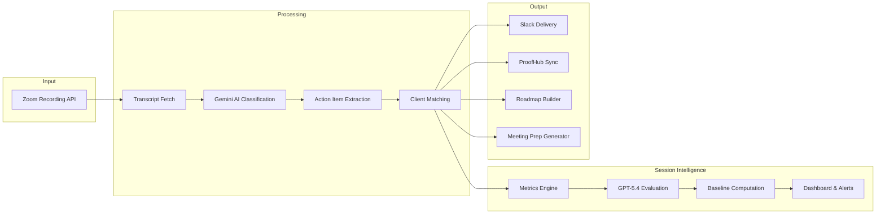

# Zoom Action Items — AI Meeting Intelligence Pipeline


Transform Zoom meeting recordings into actionable intelligence — automatically extract action items, sync to project management tools, generate strategic roadmaps, and evaluate meeting quality with AI-powered Session Intelligence.

---

## The Problem

Teams have 30+ meetings per week. Action items get lost in transcripts. Manual note-taking is incomplete and delayed. Follow-ups fall through the cracks. Meeting quality is unmeasured and coaching is reactive.

---

## The Solution

An end-to-end pipeline that automatically processes Zoom recordings and delivers actionable intelligence across multiple channels.



---

## Key Features

### Pipeline Features
- **Automatic Zoom transcript polling** — Configurable lookback window, processes new recordings every 15 minutes
- **AI-powered action item extraction** — Gemini 2.0 Flash identifies tasks, owners, deadlines, and decisions
- **Smart client matching** — Fuzzy name matching + attendee email mapping to route meetings to the right client
- **Strategic roadmap generation** — Gemini 2.5 Flash creates executive summaries and tracks commitments over time
- **Meeting prep automation** — Context from last N meetings, open items, stale tasks, suggested talking points
- **ProofHub task synchronization** — Auto-push action items to project management with confidence scoring
- **Real-time Slack notifications** — Per-client channels with formatted action items and decisions
- **Web dashboard** — Google OAuth protected interface for reviewing meetings, editing items, managing roadmaps

### Session Intelligence Features
- **Session Intelligence scoring** — GPT-5.4 evaluates every meeting on 12 quality dimensions across 3 weighted tiers (Deal Breakers 40%, Core Competence 35%, Efficiency 25%)
- **Multi-model evaluation** — Tested claude-opus-4-6, gpt-5.4, gemini-2.0-flash, gemini-3.1-pro-preview; GPT-5.4 selected as production default via consensus calibration
- **Meeting scorecards** — Per-meeting breakdown with composite score, dimension scores, coaching insights with transcript quotes, prev/next navigation, score deltas
- **Client health monitoring** — Agency-wide benchmarks (P25/P50/P75), client trend charts, team performance with difficulty-adjusted scores
- **Automated flagging** — Critical/warning flags for declining clients, low scores, no-show patterns
- **No-show detection** — Automatic classification of no-shows, test recordings, and internal meetings; excluded from quality metrics
- **AI-powered UX testing** — Playwright + Gemini vision audit agent validates the dashboard across 50+ checks
- **Human calibration framework** — Score meetings manually to validate AI model accuracy (MAE + Pearson correlation)
- **Weekly coaching digest** — Slack-formatted digest with per-member coaching, pattern alerts, frustration spikes

---

## Tech Stack

| Category | Technologies |
|----------|-------------|
| **Runtime** | Node.js, Express, PM2 |
| **Database** | SQLite (WAL mode) |
| **AI/ML** | OpenAI GPT-5.4 (session evaluation), Google Gemini (extraction, roadmaps, UX audit), Anthropic Claude (comparison) |
| **Integrations** | Zoom S2S OAuth, Slack API, ProofHub API, Google OAuth |
| **Frontend** | Vanilla JS, Server-rendered HTML |
| **Testing** | Playwright (browser automation), Gemini Vision (UX evaluation) |

---

## How It Works

1. **Poll Zoom** — Pipeline queries Zoom Recording API for new recordings in the configured lookback window
2. **Fetch Transcripts** — VTT transcripts downloaded and parsed into speaker-attributed segments
3. **AI Classification** — Gemini analyzes transcript chunks, identifies meeting type, extracts structured data
4. **Extract Action Items** — Tasks, owners, deadlines, decisions, and key discussion points extracted
5. **Match Client** — Fuzzy matching on meeting title + attendee emails maps to client configuration
6. **Deliver to Slack** — Formatted message posted to client-specific or general channel
7. **Sync to ProofHub** — High-confidence items auto-pushed; drafts queued for human review
8. **Build Roadmap** — Cross-meeting analysis creates strategic roadmap with status tracking
9. **Generate Prep** — Before meetings, dashboard shows context, open items, suggested agenda
10. **Session Evaluation** — GPT-5.4 scores meeting quality on 12 dimensions with coaching insights

---

## Session Intelligence

Evaluates meeting quality using a 12-dimension rubric scored by GPT-5.4:

### Scoring Dimensions

| Tier | Weight | Dimensions |
|------|--------|-----------|
| Deal Breakers | 40% | Client Sentiment, Accountability, Relationship Health |
| Core Competence | 35% | Meeting Structure, Value Delivery, Action Discipline, Proactive Leadership |
| Efficiency | 25% | Time Utilization, Redundancy, Client Confusion, Meeting Momentum, Save Rate |

**Composite Score** = (Tier1 avg × 0.40) + (Tier2 avg × 0.35) + (Tier3 avg × 0.25)

### Meeting Classification

| Type | Treatment |
|------|-----------|
| Regular client meeting | Fully scored, included in all metrics |
| Internal B3X meeting | Excluded from client/agency metrics |
| No-show | NULL composite, tracked as engagement pattern |
| Test recording | Excluded from everything |

### Model Selection

Production model selected via consensus calibration across 4 providers:

| Model | MAE vs Consensus | Correlation | Status |
|-------|-----------------|-------------|--------|
| GPT-5.4 | 0.229 | 0.910 | **Production default** |
| Claude Opus 4.6 | 0.246 | 0.909 | Best coaching quality |
| Gemini 2.0 Flash | 0.321 | 0.821 | Previous default |
| Gemini 3.1 Pro | 0.417 | 0.780 | Score inflation |

### Dashboard Views

- **Overview** — Agency score, client health grid, critical/warning flags
- **Meeting Scorecard** — 12-dimension breakdown, coaching insights, prev/next navigation, score deltas
- **Client Trends** — Comparison table, SVG trend charts with baseline overlays
- **Team Performance** — Member cards with difficulty-adjusted scores
- **Flags & Alerts** — Severity-based flag cards, no-show patterns
- **Calibration** — Human scoring form for model validation

---

## Results

- Processes **30+ meetings/week** across multiple clients
- **Zero missed action items** since deployment
- Meeting prep saves **15-30 minutes** per meeting
- Roadmap generation replaces **2-3 hours** of manual summary work weekly
- Action item extraction accuracy: **>90%** for explicitly stated tasks
- **75 client meetings** scored on 12 quality dimensions
- **Session Intelligence** evaluates every new meeting automatically (non-blocking)
- **No-show detection** correctly classified 10 non-meetings (7 no-shows, 3 tests)
- **Model comparison** tested 4 AI providers; GPT-5.4 selected for best consensus alignment (MAE 0.229)
- **50+ automated UI checks** via Playwright + Gemini vision audit agent

---

## Project Structure

```
zoom-action-items/
├── src/
│   ├── poll.js              # Main pipeline entry point
│   ├── api/                  # Express API server
│   ├── lib/
│   │   ├── zoom-client.js    # Zoom API integration
│   │   ├── ai-extractor.js   # Gemini AI processing
│   │   ├── client-matcher.js # Client identification
│   │   ├── slack-publisher.js# Slack notifications
│   │   ├── auto-push.js      # ProofHub sync
│   │   ├── roadmap-*.js      # Roadmap generation
│   │   ├── prep-*.js         # Meeting prep generation
│   │   ├── session-metrics.js     # SQL metrics engine (speaker ratios, action density)
│   │   ├── session-evaluator.js   # Multi-model AI evaluation (GPT-5.4 default)
│   │   ├── session-baselines.js   # P25/P50/P75 percentile computation
│   │   ├── session-queries.js     # Session Intelligence API queries
│   │   ├── session-digest.js      # Weekly coaching digest + Slack formatting
│   │   └── model-providers.js     # Unified API for OpenAI/Anthropic/Google
│   └── config/
│       └── clients.json      # Client configuration
├── public/                   # Dashboard frontend
├── scripts/
│   ├── model-comparison-v2.mjs  # Multi-model comparison with AI judge
│   ├── consensus-calibration.mjs # Consensus-based model calibration
│   └── audit-no-shows.mjs       # Retroactive meeting classification
├── tests/
│   └── session-intelligence-audit.js  # AI Playwright testing agent
└── data/                     # SQLite databases (gitignored)
```

---

## Configuration

Requires environment variables:

```bash
# Zoom S2S OAuth
ZOOM_ACCOUNT_ID=...
ZOOM_CLIENT_ID=...
ZOOM_CLIENT_SECRET=...

# Google Gemini
GOOGLE_API_KEY=...

# OpenAI (session evaluation)
OPENAI_API_KEY=...
SESSION_EVAL_MODEL=gpt-5.4

# Anthropic (model comparison)
ANTHROPIC_API_KEY=...

# Slack
SLACK_BOT_TOKEN=...

# ProofHub (optional)
PROOFHUB_API_KEY=...
PROOFHUB_SUBDOMAIN=...

# Google OAuth (for dashboard)
GOOGLE_CLIENT_ID=...
GOOGLE_CLIENT_SECRET=...
SESSION_SECRET=...
```

---

## Running

```bash
# Install dependencies
npm install

# Run pipeline once
node src/poll.js

# Run with PM2 (production)
pm2 start ecosystem.config.js

# Start dashboard
node src/api/server.js
```

---

## License

MIT
